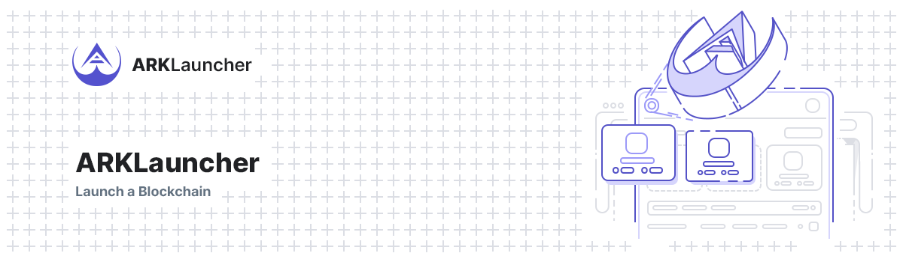

# ARKLauncher Demo



ARKLauncher is a powerful tool that significantly reduces the time required to launch your own custom blockchain, removing much of the complexities associated with such a task. Using ARKLauncher’s Blockchain Wizard, you can set up and launch your own blockchain in just a few steps.

## Installation

### Requirements

-   [Composer](https://getcomposer.org)
-   [Valet](https://laravel.com/docs/master/valet) or [Homestead](https://laravel.com/docs/master/homestead)
-   [Yarn](https://yarnpkg.com/en/docs/install)

### Development

Currently the instructions are for Valet:

```bash
git clone https://github.com/ArkEcosystem/one-click.git
cd one-click
composer install
yarn install

cp .env.example .env
php artisan key:generate

composer db:dev
# or when you want to start with a few tokens: composer db:staging
yarn watch

valet link one-click

php artisan horizon
```

#### Login

Defaut login information is:

username: `hello@ark.io`
password: `password`

## Local Server Deployments

When running ARKLauncher locally, you have to keep a few things in mind to ensure that local server deployments succeed.

First, make sure that you have a tunnel open through either ngrok (e.g. `valet share`) or [Expose](https://expose.dev/docs/introduction), and set this value as your `APP_URL` in your `.env`. This is needed to allow the server to post its progress back to ARKLauncher while it's setting up the server. If you forget to do so, you will find that ARKLauncher gets stuck on the first setup step while it will be installining fine if you check the progress on the actual server.

With the URL available, it's time to start horizon. Run `php artisan horizon` to make sure that horizon has the latest configuration loaded and will make use of your up-to-date `APP_URL`. Make sure to restart horizon when you change the URL, or it will end up using outdated data during deployments.

Some of the server providers do not immediately return an IP address when you create a server through their API. As a result, we have to periodically poll the created server on the provider to check if an IP has been assigned yet, before we can continue the rest of the deployment. Therefore you have to make sure that you run the scheduler through `php artisan schedule:work` or by calling the respective command (see the `SyncServerRemoteAddresses` class) manually until you receive an IP.

## Troubleshooting

If you run into errors, try the following first before resorting to slack / google:

-   clear caches: `php artisan cache:clear && php artisan route:clear && php artisan config:clear && php artisan view:clear`
-   clear bootstrap: `rm bootstrap/cache/*`
-   restart horizon: `php artisan horizon`
-   seed the db: `composer db:dev`

### Provisioning a DigitalOcean server fails

As DigitalOcean assigns a public IP address to the server only when server is built (typically taking a few minutes), ARKLauncher has to periodically check whether the server has a new IP address assigned. This is typically done via Cronjob, so make sure to run the Laravel Scheduler in addition to the Horizon worker.

```bash
php artisan schedule:work
```

Not running the Scheduler will result in `ServerProvisioner` job timeout / fail because the server won't have the IP assigned.

## Contributing

Please see [Contributing Guidelines](https://docs.ark.io/guidebook/contribution-guidelines/contributing.html) for details.

## Credits

-   [All Contributors](../../contributors)

## AS-IS Clause

ARKLauncher is provided "AS-IS" and without any warranty of any kind, whether express, implied or statutory, including but not limited to the warranties of merchantability, fitness for a particular purpose, and non-infringement. The entire risk as to the quality and performance of ARKLauncher is with you. Should ARKLauncher prove defective, you assume the cost of all necessary servicing, repair, or correction.

In no event shall the author of ARKLauncher be liable to you or any third parties for any damages arising out of or in connection with the use or inability to use ARKLauncher, including but not limited to damages for loss of profits, business interruption, or loss of data, even if the author of ARKLauncher has been advised of the possibility of such damages.

By using ARKLauncher, you agree to indemnify and hold harmless the author of ARKLauncher and any contributors to ARKLauncher from and against any claims, actions, or demands, including without limitation reasonable legal and accounting fees, arising from or related to your use of ARKLauncher or your violation of these terms and conditions.

## Copyright

ARKLauncher is a powerful open-source tool for creating and deploying custom blockchains based on the ARK Core layer 1 protocol in as little as an hour hereinafter referred to as "the Program". The Program is licensed under the terms of the GNU General Public License version 3 ("GPLv3").

Copyright (C) 2023 [ARK Ecosystem](https://arkscic.com/)

This program is free software: you can redistribute it and/or modify
it under the terms of the GNU General Public License as published by
the Free Software Foundation, either version 3 of the License, or
(at your option) any later version.

This program is distributed in the hope that it will be useful,
but WITHOUT ANY WARRANTY; without even the implied warranty of
MERCHANTABILITY or FITNESS FOR A PARTICULAR PURPOSE. See the
GNU General Public License for more details.

You should have received a copy of the GNU General Public License
along with this program. If not, see <https://www.gnu.org/licenses/>.

## License

[GNU General Public License v3.0](LICENSE) © [ARK Ecosystem](https://arkscic.com/)
